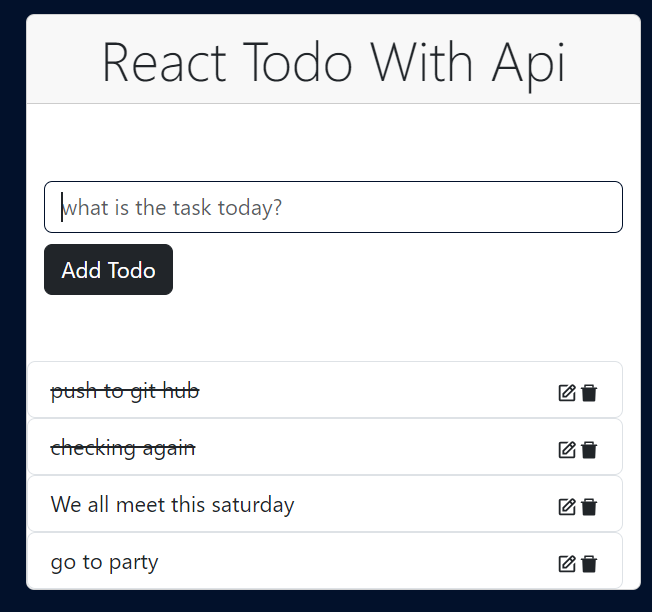

# REACT TODO APP WITH JSON-SERVER
This is a simple CRUD application with react using;

*bootstrap
*json-server
*react-icons

## Installation
You can download the repo and study the code

* open repo with vscode or any code editor
* npm install to get all the packages

## JSON-SERVER
For this just run ;
* npm install json-server -w ./data/db.json -p 4040 
note that the port can be any number that is not clashing with any other port
* in the db.json you can create an object with a key and empty list (check image)

* The image shows data added already from the frontend

## The View

# Explaining The CRUD

## The Create and Retrieve View
* Typing into the input

* Showing the submit result

## The Update View
* when you click on the edit icon the data appears in a form and shows
you the text and a button

* The result when you make changes

## The Delete View
* When you click the trash icon , the task get deleted 

## Completed task
* A completed task is been crossed through

Note that all this changes is not on the UI alone but also on the json data

Thanks for following me, love you and anticipate more react projects